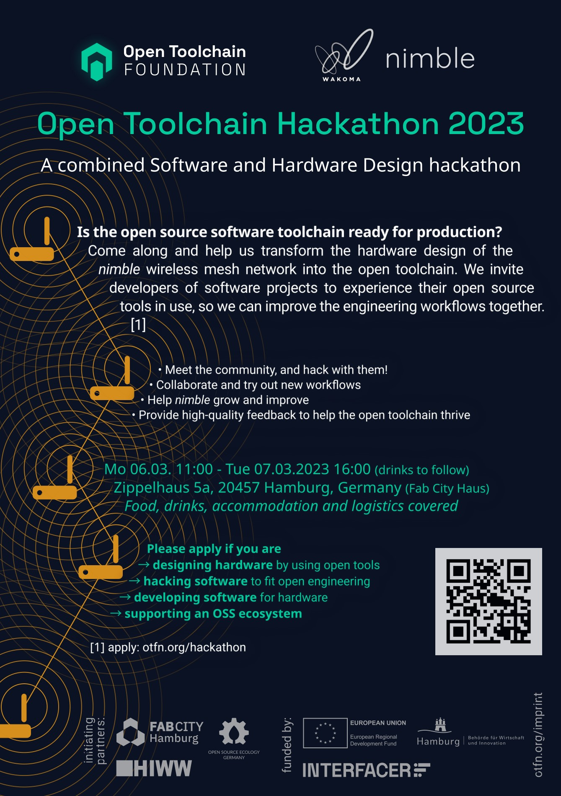
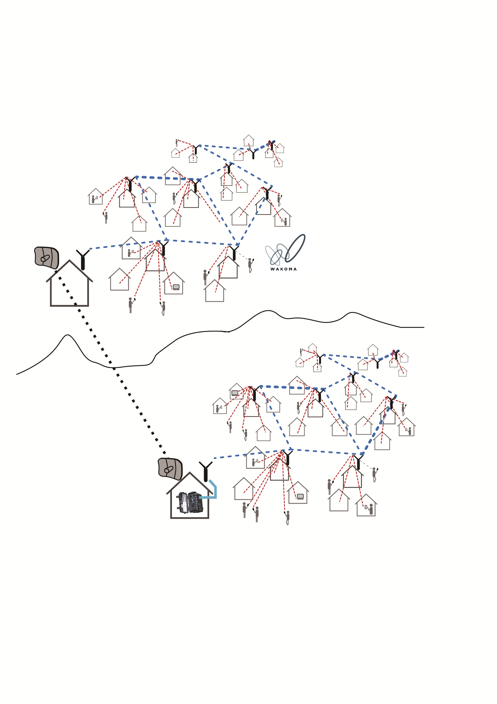

<!--
SPDX-FileCopyrightText: 2020-2023 Eric Nitschke <eric@wakoma.co>
SPDX-FileCopyrightText: 2023 Robin Vobruba <hoijui.quaero@gmail.com>

SPDX-License-Identifier: CERN-OHL-S-2.0
-->

# nimble

An open source, rapidly deployable, wireless mesh network.

Anyone connected to the nimble can video and voice chat,
stream videos, share files, build and run eLearning courses and website,
create collaborative spreadsheets and documents, read e-books, play games,
and so much more…
completely offline.

If a single internet connection is available,
it can be plugged into the nimble to provide free or paid internet access
to anyone on the network.
The offline services and content are always available to users,
regardless of internet availability.

Anyone in the world can build their own nimble
with locally sourced hardware and 3D-printed components.

* [nimble Website](https://wakoma.co/nimble/)
* [Matrix Space](https://matrix.to/#/!JWutrWVlqsuiauWbPf:wakoma.net?via=wakoma.net)
* [Twitter](https://twitter.com/WakomaInc)
* Mastodon, Peertube, Pixelfed (coming soon)
* [Zotero Library](https://www.zotero.org/groups/2403673/communitynetworks/library)

## State of this repository

This repository is in transition as we work towards making all of the mechanical models parametric, and automatically generating the documentation for any configuration. See the [post-hackathon release](https://github.com/Wakoma/nimble/releases/tag/Post-hackathon) for the state of the repository before these changes.

## Recent Event

More event information [here](https://otfn.org/hackathon/)

## Important Links

* [Nimble website](https://wakoma.co/nimble/)
* [Nimble printables page](https://www.printables.com/model/80708-wakoma-nimble-new-2021-model)
* [State of this repository after the OTFN hackathon](https://github.com/Wakoma/nimble/releases/tag/Post-hackathon)

## Support

For more info have a look at <https://wakoma.co/nimble>,
or reach out to <mailto:info@wakoma.co>.

