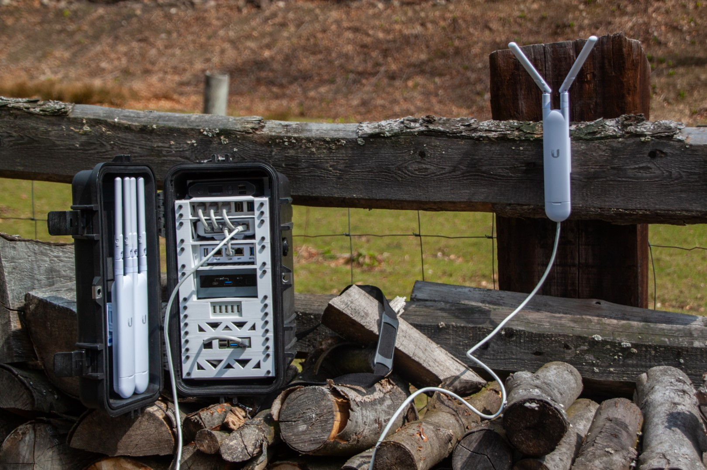

<!--
SPDX-FileCopyrightText: 2020-2023 Eric Nitschke <eric@wakoma.co>

SPDX-License-Identifier: CERN-OHL-S-2.0
-->

# nimble

An open source, rapidly deployable, wireless mesh network.

Anyone connected to the nimble can video and voice chat, stream videos, share files, build and run eLearning courses and website, create collaborative spreadsheets and documents, read e-books, play games, and so much more…completely offline.

If a single internet connection is available, it can be plugged into the nimble to provide free or paid internet access to anyone on the network. The offline services and content are always available to users, regardless of internet availability.

Anyone in the world can build their own nimble with locally sourced hardware and 3D-printed components.

* [nimble Website](https://wakoma.co/nimble/)
* [Discussion Forums](https://forums.wakoma.co/)
* [Matrix Space](https://matrix.to/#/!JWutrWVlqsuiauWbPf:wakoma.net?via=wakoma.net)
* [Twitter](https://twitter.com/WakomaInc)
* Mastodon, Peertube, Pixelfed (coming soon)
* [Zotero Library](https://www.zotero.org/groups/2403673/communitynetworks/library)

# Upcoming Event!

More event information [here](https://otfn.org/hackathon/)

# Important Links

https://wakoma.co/nimble/

https://www.printables.com/model/80708-wakoma-nimble-new-2021-model

# Support

For more info have a look at http://wakoma.co/nimble, or reach out to info@wakoma.co.

