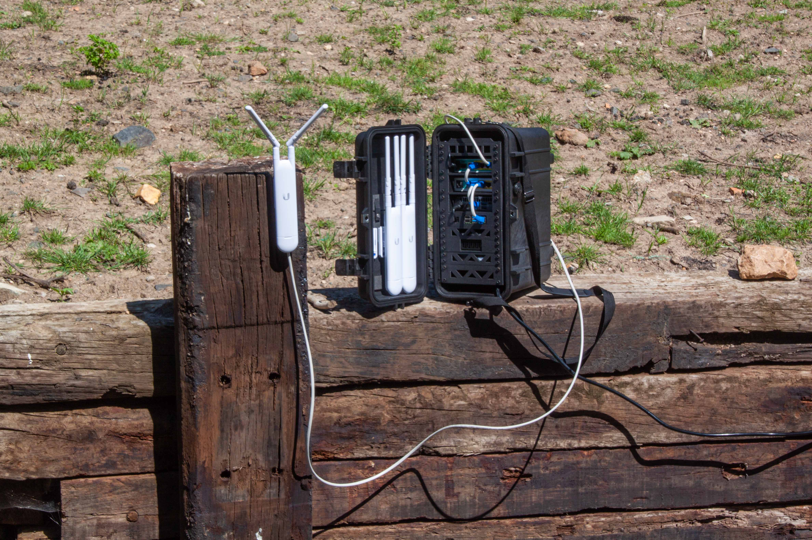
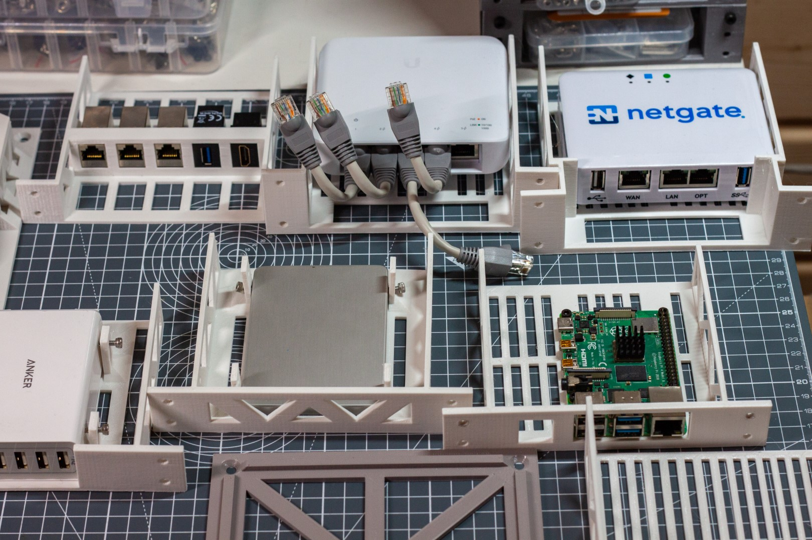

# Nimble Assembly Guide

## What is Nimble

Nimble is an open source, rapidly deployable, wireless mesh network.

Anyone connected to the nimble can video and voice chat, stream videos, share files, build and run eLearning courses and website, create collaborative spreadsheets and documents, read e-books, play games, and so much more… completely offline.

If a single internet connection is available, it can be plugged into the nimble to provide free or paid internet access to anyone on the network. The offline services and content are always available to users, regardless of internet availability.

Anyone in the world can build their own nimble with locally sourced hardware and 3D-printed components.

You can find out more about Nimble on [our website](https://wakoma.co/nimble/).

## Customisation

Nimble, as an open source project, is designed so that you can tailor it to your own needs and to the hardware that you have available.

We are [working on building a an interface for customising your nimble](https://github.com/Wakoma/nimble/pull/23). In the mean time this is an example of the assembly instructions for a specific configuration.

To customise your Nimble you can go to [our GitHub](https://github.com/Wakoma/nimble). If you aren't sure where to start, you can always ask for help by [opening an issue](https://github.com/Wakoma/nimble/issues) or [starting a discussion](https://github.com/Wakoma/nimble/discussions).

## Building your Nimble

In the next pages we will build [your nimble](config.md){step}.
