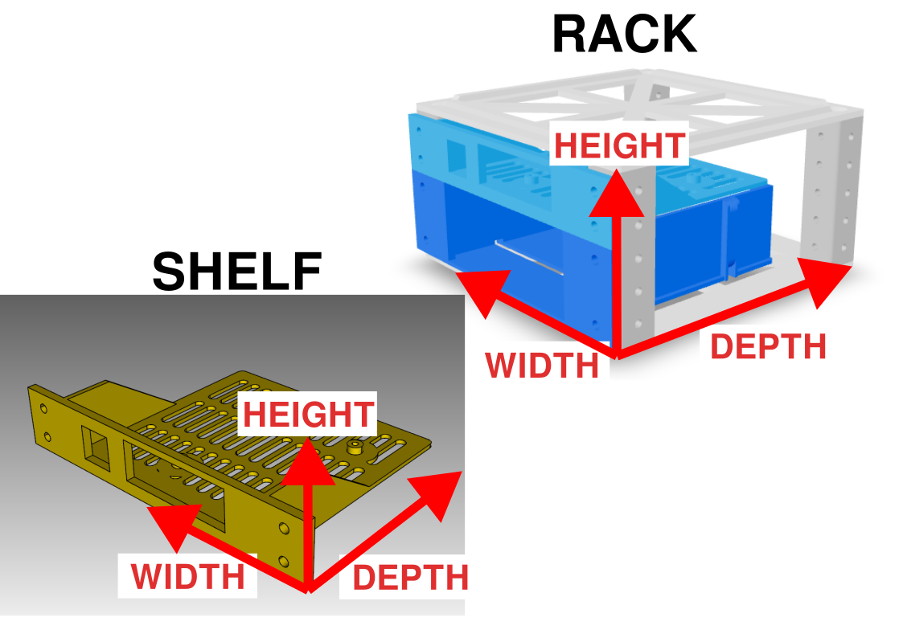

This directory holds CAD files that are used to generate Nimble racks.

# Dimension Names

Standard dimension names are needed to ensure proper orientation of the shelf, hardware and rack models, and the diagram below outlines the system employed for the Nimble rack and shelf CAD. When creating new CAD models, or adding data for existing hardware to the database, please follow these conventions.

